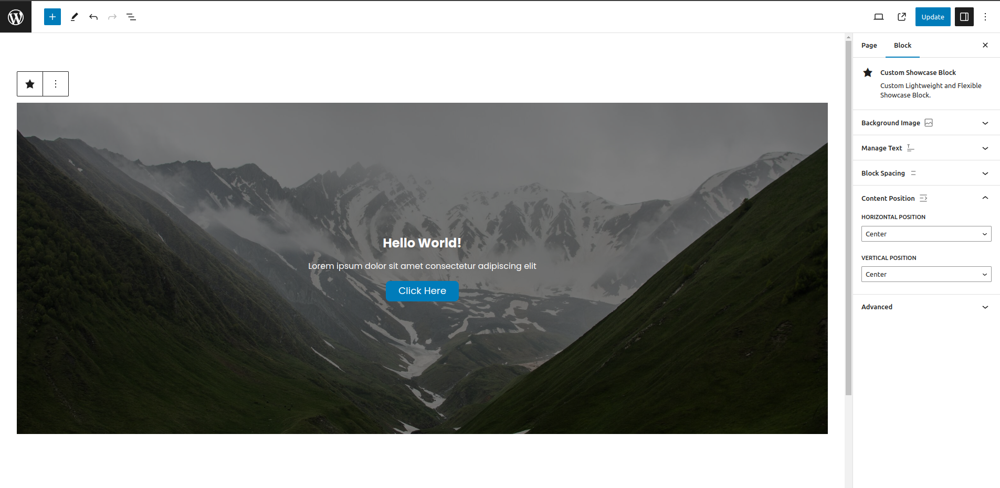

# Custom Showcase Block

> **Author**: Hart Pableo  
> **Platform**: WordPress  
> **Tech**: Javascript, PHP, SCSS

## Description

This is a simple, custom showcase block that you can use to add to your website and improve your content!

## Features

- Images
  - Upload, Change, or Remove background image
  - Add image overlay with color of your choice
  - Headline icon included
- Text
  - Headline text
  - Sub-headline text
  - Color Picker for customizing text/font color
- Button
  - Button text
  - Button link
  - Choice to open in new tab or not
  - If empty, will not render the button on the front-end
- Content Alignment
  - Has horizontal alignment options (left, center, right)
  - Has vertical alignment options (top, center, bottom)
  - Both alignments can be combined to achieve the layout of your choice
  
## Contact Author

You can contact me via email: pableoh@gmail.com